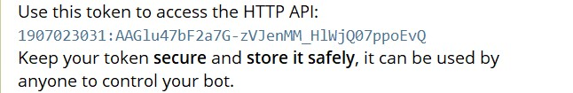

# Telegram-Bot

Telegram bot built with Python

### How to run

1. Go to telegram and search for BotFather

2. Type /newbot to create a new bot

3. Copy the token

   
   
4. Paste the token inside

   
   
5. Run the code
